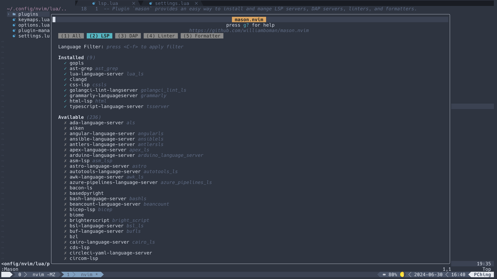

# LSP
LSP 的全名為 Language Server Protocol，如名所述，它定義了 Language Clients 與 Language Servers 對接的方法。Language Servers 提供了即時的語法分析，當安裝了某個語言的 Language Server 後不同的 Language Clients （如 Neovim、VSCode 等編輯器）就可以與該 Language Server 溝通，呈現編輯時的語法檢查、程式碼補齊等功能。Neovim 中有許多與 LSP 相關的 Plugins 可以幫助使用者管理 LSP Servers 與設定 LSP Clients。

## LSP Servers Management
### mason
`mason` 讓使用者能在 Neovim 中管理 LSP Server 的安裝、更新和刪除，`mason` 提供了很多個 LSP Servers 可以下載。除了 LSP Servers 外，`mason` 也是提供了 DAP servers、linters、和 formatter 的管理。
- 在 `lua/plugins/` 下新增一個 `lsp.lua` 檔案，當中新增下列內容並儲存退出後再進入 Neovim 並透過 `:Lazy` 進入 Lazy console 進行 plugin 安裝。
    ``` lua
    return
    {
        {
            "williamboman/mason.nvim", -- plugin-short-url
            enabled = true,
            opts = {
                ui = {
                    icons = {
                        package_installed = "✓",
                        package_pending = "➜",
                        package_uninstalled = "✗",
                    },
                    border = "rounded",
                },
            },
        },
    }
    ```
- 安裝後再次進入 Neovim 就可以透過`:Mason` 指令進入 Mason console 查看 Mason 所提供的 servers 和目前的狀態。
    
- 透過 `:MasonInstall <server_name>` 安裝 Mason 所提供的 servers 
    - 這裡 `<server_name>` 會是 Mason console 列表中第一個名字
    - e.g. `:MasonInstall typescript-language-server`
### mason-lspconfig
`mason-lspconfig` 會檢查所需的 LSP servers（Mason 有提供的）是否安裝了，如果還沒就會幫使用者自動透過 Mason 下載安裝。
- 在 `lua/plugins/lsp.lua` 檔案中新增一個 `language_servers` list 和第二個 plugin 的設定內容，儲存退出後再進入 Neovim 並透過 `:Lazy` 進入 Lazy console 進行 plugin 安裝。
    ```
    language_servers = {
        <server_name_1>, -- e.g. "lua_ls"
        <server_name_2>, -- e.g. "tsserver"
        ...
    }
    return
    {
        {
            "williamboman/mason.nvim", -- plugin-short-url
            enabled = true,
            opts = {
                ui = {
                    icons = {
                        package_installed = "✓",
                        package_pending = "➜",
                        package_uninstalled = "✗",
                    },
                    border = "rounded",
                },
            },
        },
        {
            'williamboman/mason-lspconfig.nvim', -- plugin-short-url
            config = function()
                require("mason-lspconfig").setup({
                    ensure_installed = language_servers,
                    automatic_installation = true,
                })
            end,
            dependencies = { 'williamboman/mason.nvim' }
        },
    }
    ```
- 退出後再進入 Neovim 就會開始自動安裝 `language_servers` 中寫的 LSP Servers。
- Note: 利用 `:MasonInstall <server_name>` 的 `<server_name>` 跟寫在 `language_servers` 中的 `<server_name>` 可能會不同。
    - e.g. 要利用 mason-lspconfig 自動安裝 typescript-language-server 的話，`language_servers` 中要寫入 `"tsserver"` 而非 `"typescript-language-server"`


## LSP Client Configuration
### nvim-lspconfig 
`nvim-lspconfig` 提供 LSP Clients 的客製化選項，例如是否要利用浮動視窗呈現訊息、警告和錯誤的符號該是什麼、每個 language servers 使用時有什麼設定等。我個人認為 nvim-lspconfig 是 Neovim 中設定起來前三繁雜的 plugin，不過理解之後其它的 plugin 設定就顯得容易多了。
- 在 `lua/plugins` 下新增一個 `language-settings` 資料夾用來放不同 language servers 的設定。
- 繼續在 `lua/plugins/lsp.lua` 檔案中新增第三個 plugin 的設定，儲存退出後再進入 Neovim 並透過 `:Lazy` 進入 Lazy console 進行 plugin 安裝。
    ```
        {
            'neovim/nvim-lspconfig',
            enabled = true,
            dependencies = { "williamboman/mason-lspconfig.nvim", "williamboman/mason.nvim", "hrsh7th/cmp-nvim-lsp" },
            config = function()
                -- Function to run when attaching to a new buffer with an LSP client.
                local on_attach = function(client, bufnr)
                    if client.name == "tsserver" then
                        client.server_capabilities.documentFormattingProvider = false
                    end
                    -- Keymap options
                    local opts = { noremap = true, silent = true }
                    -- Keymap api
                    local buf_keymap = vim.api.nvim_buf_set_keymap
                    buf_keymap(bufnr, "n", "<leader>gD", "<cmd>lua vim.lsp.buf.declaration()<CR>", opts)
                    buf_keymap(bufnr, "n", "<leader>gd", "<cmd>lua vim.lsp.buf.definition()<CR>", opts)
                    buf_keymap(bufnr, "n", "K", "<cmd>lua vim.lsp.buf.hover()<CR>", opts)
                    buf_keymap(bufnr, "n", "gi", "<cmd>lua vim.lsp.buf.implementation()<CR>", opts)
                    buf_keymap(bufnr, "n", "<C-s>", "<cmd>lua vim.lsp.buf.signature_help()<CR>", opts)
                    buf_keymap(bufnr, "n", "gr", "<cmd>lua vim.lsp.buf.references()<CR>", opts)
                    buf_keymap(bufnr, "n", "gl", '<cmd>lua vim.diagnostic.open_float()<CR>', opts)
                    buf_keymap(bufnr, "n", "[d", '<cmd>lua vim.diagnostic.goto_prev({ border = "rounded" })<CR>', opts)
                    buf_keymap(bufnr, "n", "]d", '<cmd>lua vim.diagnostic.goto_next({ border = "rounded" })<CR>', opts)
                    buf_keymap(bufnr, "n", "<leader>q", "<cmd>lua vim.diagnostic.setloclist()<CR>", opts)
                    vim.cmd [[ command! Format execute 'lua vim.lsp.buf.formatting()' ]]
                    -- vim.api.nvim_buf_set_keymap(bufnr, "n", "<leader>ca", "<cmd>lua vim.lsp.buf.code_action()<CR>", opts)
                    -- vim.api.nvim_buf_set_keymap(bufnr, "n", "<leader>rn", "<cmd>lua vim.lsp.buf.rename()<CR>", opts)
                end

                -- The `nvim-cmp` almost supports LSP's capabilities so You should advertise it to LSP servers..
                local capabilities
                local status_ok, cmp_nvim_lsp = pcall(require, "cmp_nvim_lsp")
                if status_ok then
                    capabilities = cmp_nvim_lsp.default_capabilities()
                end

                local lspconfig = require('lspconfig')

                -- Define diagnostic signs for error, warning, hint, and info.
                local signs = {
                    { name = "DiagnosticSignError", text = "" },
                    { name = "DiagnosticSignWarn", text = "" },
                    { name = "DiagnosticSignHint", text = "" },
                    { name = "DiagnosticSignInfo", text = "" },
                }
                for _, sign in ipairs(signs) do
                    vim.fn.sign_define(sign.name, { texthl = sign.name, text = sign.text, numhl = "" })
                end

                -- Define diagnostic configuration for virtual text, signs, and float windows.
                local config = {
                    virtual_text = true,
                    signs = {
                        active = signs,
                    },
                    update_in_insert = true,
                    underline = true,
                    severity_sort = true,
                    float = {
                        focusable = true,
                        style = "minimal",
                        border = "rounded",

                        header = "",
                        prefix = "",
                    },
                }

                -- Configure diagnostics with defined settings.
                vim.diagnostic.config(config)

                -- Customize hover and signature help handlers for LSP.
                vim.lsp.handlers["textDocument/hover"] = vim.lsp.with(vim.lsp.handlers.hover, {
                    border = "rounded",
                })

                vim.lsp.handlers["textDocument/signatureHelp"] = vim.lsp.with(vim.lsp.handlers.signature_help, {
                    border = "rounded",
                })

                local opts = {
                    on_attach = on_attach,
                    capabilities = capabilities,
                }

                -- Setup LSP servers based on predefined configurations.
                for _, language_server in pairs(language_servers) do
                    language_server = vim.split(language_server, "@")[1]
                    local require_ok, conf_opts = pcall(require, "plugins.language-settings." .. language_server)
                    if require_ok then
                        conf_opts = vim.tbl_deep_extend("keep", conf_opts, opts)
                        lspconfig[language_server].setup(conf_opts)
                    else
                        lspconfig[language_server].setup(opts)
                    end
                end
            end
        }
    ```

