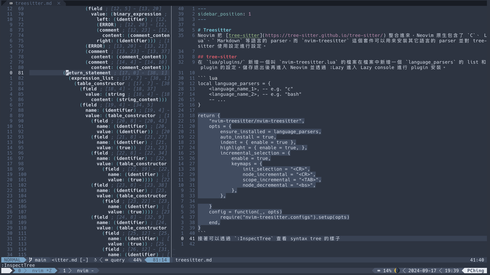

# Treesitter
Neovim 把 [tree-sitter](https://tree-sitter.github.io/tree-sitter/) 整合進來，Neovim 原生包含了 `C`、`Lua`、` Markdown` 等語言的 parser，而 `nvim-treesitter` 這個套件可以用來安裝其它語言的 parser 並對 tree-sitter 使用設定進行設定。而 `nvim-treesitter-textobjects` 這個套件結合了 vi 中 [text objects](../basic-ways-to-change-text-in-vi#text-objects) 的概念，可以對 parse 出的 nodes 進行更多的操作。

## nvim-treesitter
在 `lua/plugins/` 新增一個叫 `nvim-treesitter.lua` 的檔案在檔案中新增一個 `language_parsers` 的 list 和 plugin 的設定。儲存退出後再進入 Neovim 並透過 :Lazy 進入 Lazy console 進行 plugin 安裝。

``` lua
local language_parsers = {
    <language_name_1>, -- e.g. "c"
    <language_name_2>, -- e.g. "bash"
    -- ...
}

return {
    "nvim-treesitter/nvim-treesitter",
    opts = {
        ensure_installed = language_parsers,
        auto_install = true,
        indent = { enable = true },
        highlight = { enable = true, },
        incremental_selection = {
            enable = true,
            keymaps = {
                init_selection = "<CR>",
                node_incremental = "<CR>",
                scope_incremental = "<TAB>",
                node_decremental = "<bs>",
            },
        },

    }
    config = function(_, opts)
        require("nvim-treesitter.configs").setup(opts)
    end,
}
```
接著可以透過 `:InspectTree` 查看 parser 所建立的 syntax tree 的樣子，樹中的 nodes 和 code 的內容會相互呼應。
 

## nvim-treesitter-textobjects


