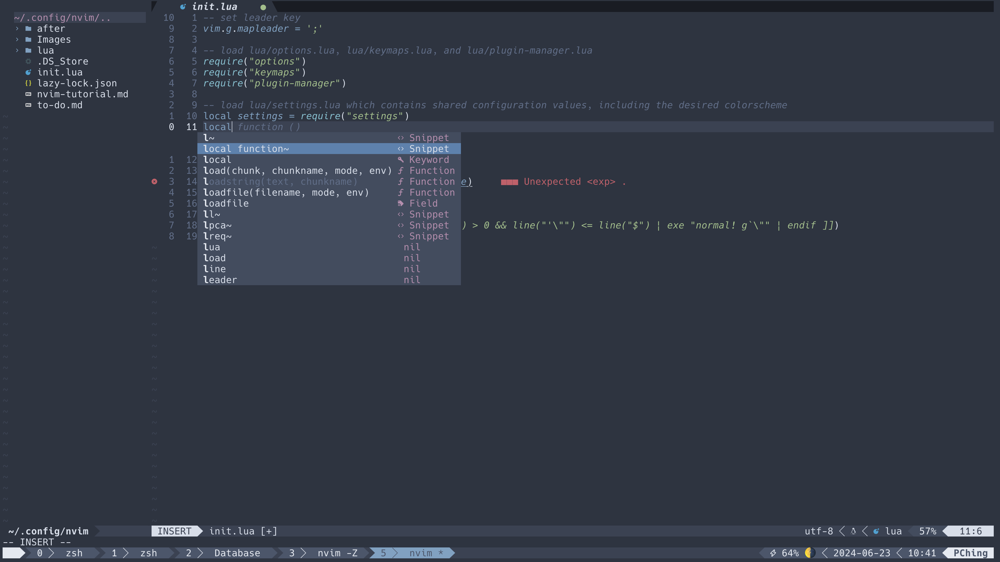

# Neovim Configuration with Lua
- This tutorial is written to help you configure Neovim using Lua
- 在安裝完 Neovim 後進入 Neovim 預設的 config 檔案路徑
    - Linux、BSD、macOS 在 `~/.config/nvim/`
        ``` bash
        cd ~/.config/nvim/
        ```
    - Windows 在 `~/AppData/Local/nvim/`
        ``` psh
        cd ~/AppData/Local/nvim/
        ```
- 如果看完這一篇 Neovim Configuration with Lua 可以獲得利用 Lua 設定 key mappings 跟 options 的能力
- 如果看完整個 Neovim tutorial 包含 plugins 設定完會長得像這張圖。（最下面那一行是 tmux status bar）
    

## Directory Structure
使用 Lua 設定 Neovim 時，為了要正確載入 config 檔案，目錄結構會長得像下面的範例
-  `init.lua` 或 `init.vim` 在 config 檔案路徑下，這個 `init` 檔案是設定檔的載入點
    - Neovim 支援在 `init.lua` 或 `init.vim` 使用 Lua 或 Vimscript
-  `lua/` 資料夾放置 Lua modules
``` bash
~/.config/nvim # [ or ~/AppData/Local/nvim ]
|-- init.lua # [or init.vim (https://neovim.io/doc/user/lua-guide.html#lua-guide-config)]
|-- lua/
    |-- module_a.lua # (e.g. keymaps.lua or options.lua)
    |-- plugin-manager.lua
    |-- plugins/
        |-- init.lua
        |-- plugin_a.lua
        |-- plugin_b.lua
```
## Code in `init.lua` or `init.vim`
在 `init.lua` 或 `init.vim` 中利用 `require("<lua_module>")` 載入 `lua/` 下的 Lua modules。
 在下面範例中 `options`、`keymaps`、`plugin-manager`、`settings` 都是 `lua/` 下後綴為 `.lua` 的 Lua 檔案
``` lua
-- set leader key
vim.g.mapleader = ';'

-- load lua/options.lua, lua/keymaps.lua, and lua/plugin-manager.lua
require("options")
require("keymaps")
require("plugin-manager")

-- load lua/settings.lua which contains shared configuration values, including the desired colorscheme
local settings = require("settings")

-- set colorscheme
vim.cmd('colorscheme ' .. settings.colorscheme)
```

## [Lua Modules](https://neovim.io/doc/user/lua-guide.html#lua-guide-modules)
- 如同前面提到 Lua modules 是會藉由 `require("<lua_module>")` 載入 Neovim
    > Lua modules are found inside a `lua/` folder in your `'runtimepath'` (for most users, this will mean `~/.config/nvim/lua` on *NIX systems and `~/AppData/Local/nvim/lua` on Windows). You can `require()` files in this folder as Lua modules.

    > Place Lua files in the `lua/` directory in `‘runtimepath’` and load them with require
- Lua modules 可以透過不同種的寫法載入
    - Load `module_a.lua` (inside the `lua/` folder)
        ``` lua
        require("module_a")
        ```
    - Load `plugins/plugin_a.lua` (inside the `lua/` folder)
        ``` lua
        require('plugins/plugin_a')
        -- or
        require('plugins.plugin_a')
        ```
    - Load `plugins/init.lua` (inside the `lua/` folder)
        ``` lua
        require('plugins')
        ```

## Key Mappings
- You can customize Neovim's key bindings by mapping either Vim commands or Lua functions to key sequences
- You can create a new file named `keymaps.lua` to hold the mapping code.
    - Place the file in the `lua/` directory
    - Load the file in `init.lua`

### `keymap` Function in Lua
- Neovim's API [`vim.api.nvim_set_keymap`](https://neovim.io/doc/user/api.html#nvim_set_keymap()) sets a global mapping for the given mode
- Function interface: `nvim_set_keymap( {mode}, {lhs}, {rhs}, {opts})`
    - `mode`: Mode short-name (e.g. n, i, v, …) 要綁定的 mode
    - `lhs`: Left-hand-side of the mapping. 要把什麼 key 綁定功能（之後使用的快捷鍵）
    - `rhs`: Right-hand-side f the mapping. 要綁定什麼功能
    - `opts`: Optional parameters map. 綁定設定，通常會設定 `noremap` 和 `silent`（我沒找到完整的文件 list）
        - `noremap` 為 true 是指這個 mapping 是 **non-recursive** 的，它會直接 map 到把 `rhs` 當作 literal string of commands 執行，不會使 `rhs` 其它 mapping 後的結果
        - `silent` 為 true 就是不會在 command line 顯示你使用的 `rhs` ，亦即能在使用快捷鍵時不受干擾

### Code in `keymaps.lua`
- Assign a variable `keymap` to hold a reference to the function
    ``` lua
    local keymap = vim.api.nvims_set_keymap
    ```
- Assign a variable `opts`  to hold opts arguments
    ``` lua
    local opts = { noremap = true, silent = true }
    ```
- Call `keymap` function
    ``` lua
    keymap( {mode}, {lhs}, {rhs}, opts)
    ```
    - Example: `keymap("n", "<C-L>", ":update", opts)` means "using `Ctrl+l` to save file in NORMAL mode"

### Some Recommended Mappings
#### Move text up and down
``` lua
keymap("n", "<M-j>", ":m .+1<CR>==", opts) -- Move text down
keymap("n", "<M-k>", ":m .-2<CR>==", opts) -- Move text up
```
#### Return to NORMAL Mode Quickly
- 我無法割捨的 keymap
``` lua
keymap("i", "jj", "<ESC>", opts)
```
#### Close Buffer
- 前言：無法滑順地將 buffer 關閉是困擾我許久的問題，幸好最後解決的
    - 如果只用 `:bd` 關到最後一個的時候會長出 [No name] buffer
    - 滑順地將 buffer 關閉：利用快捷鍵將 buffer 關閉，並在剩下一個 buffer 時關掉整個 window

``` lua
-- Function to close buffer or window
function Close_buffer_or_window()
    vim.api.nvim_command('bn!')
    local success = pcall( vim.api.nvim_command, 'bd#')
    if not success then
        -- Check if there is only one window left
        -- if #vim.api.nvim_list_wins() == 1 then
        vim.api.nvim_command('q')
    end
end

-- Map a key to call the function to close buffer or window
vim.api.nvim_set_keymap("n", "<C-\\>", "<CMD>lua Close_buffer_or_window()<CR>", { noremap = true, silent = true })
```
- 利用檢查是否能跳到下一個 buffer 判斷要關閉 buffer 還是關閉整個 window

## Options
- You can customize various options and settings for Neovim.
- You can create an `options.lua` file in your Neovim `lua` directory
    - Place the file in the `lua/` directory
    - Load the file in `init.lua`

### A Convenient Way
- A special interface `vim.opt` use table indexing to set options
    - Example: `vim.opt[key] = value`

### Code in `options.lua`
- Assign a variable `options`  to hold key-value pairs representing the options
    ``` lua
    local options = { <opt_key1> = <opt_value2>, ... }
    ```
    - Example
        ``` lua
        local options = { 
            number = true,
            relativenumber = true,
            smartindent = true,
            smartcase = true,
            termguicolors = true,
            ruler = true,
            cursorline = true,
            encoding = "UTF-8",
            fileencodings = "utf-8",
            smarttab = true,
            expandtab = true,
            shiftwidth = 4,
            tabstop = 4,
            hidden = false,
            mouse="i",
            statuscolumn = "%s%2r  %2l ", -- ▎
            signcolumn = "yes"
        }
        ```
- Iterate the `options` table to set options
    ``` lua
    for key, value in pairs(options) do
        vim.opt[key] = value
    end
    ```


